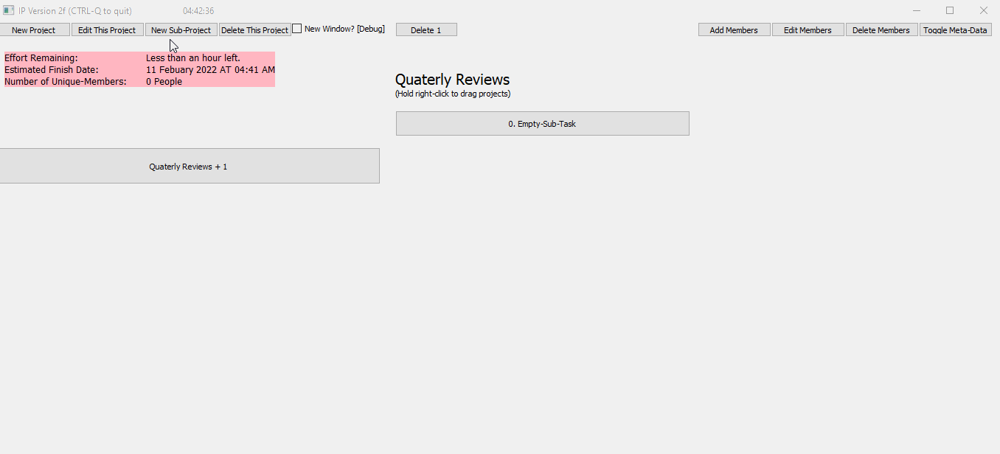
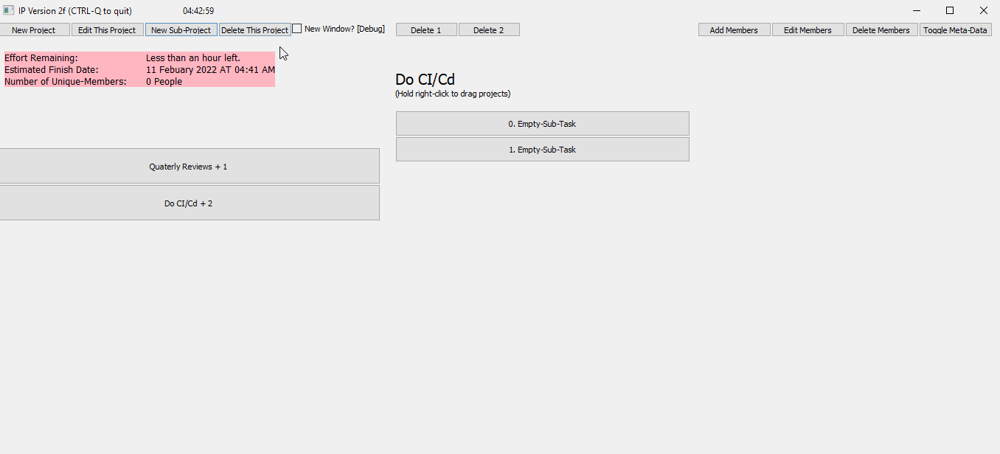
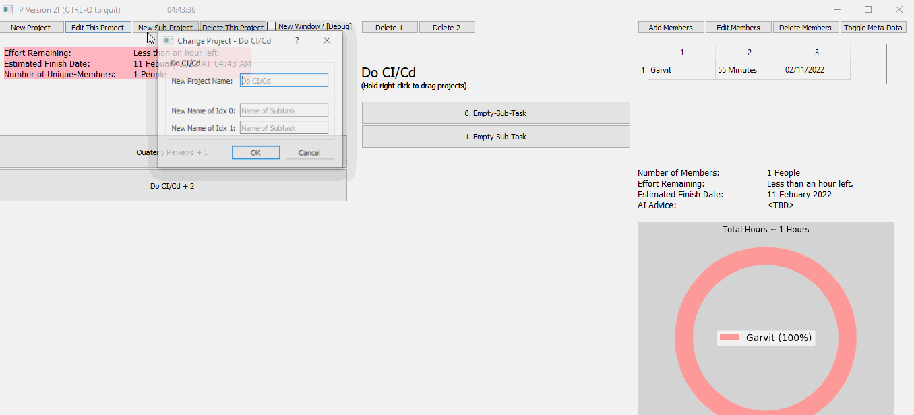

# IP - Version 1.0
GUI Stuff w/ Python. I ported this idea into a web-app: [https://github.com/gjairath/IP_Version_2.0].

# Description
An intelligent planner for myself to replace the need of i-notes and word-pad files or word-files so I can find ways to not do things and have a computer track my not doing things instead of actually doing them. 

# View

   
   

   
   

   

# Deployment
conda activate
Try python ip_main.py
